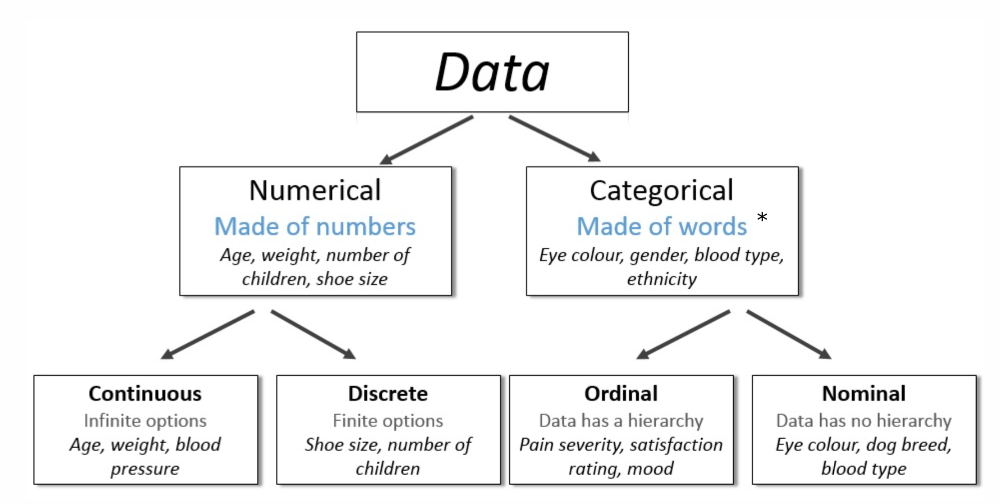

# Introduction

## Definition Machine Learning

"Field of study that gives computer the ability to learn without being explicitly programmed."

"A computer program is said to learn from experience $E$ with respect to some task $T$ and some performance measure $P$, if its performance on $T$, as measured by $P$, improves with experience $E$."

Diese beiden Definitionen beschreiben das Ziel von Machine Learning, die Strategien um dieses Ziel zu erreichen unterteilt ML in verschiedene Disziplinen.

## Machine Learning Disziplinen

- Supervised Learning
  - Algorithmus bekommt gelablete Trainingsdaten
  - Algorithmus lernt das Label vorherzusagen von ungesehenen Daten
- Unsupervised Learning
  - Algorithmus bekommt ungelabelte Daten
  - Algorithmus erkennt und nützt die grundlegende Struktur der Daten
- Semi-Supervised Learning
  - Mix aus Supervised und Unsupervised Learning
  - Wird meist gebraucht wenn es nur sehr wenig gelabelte Daten gibt
- Reinforcement Learning
  - Keine Daten verfügbar aber der Algorithmus wird durch eine Reward Funktion gelenkt
  - Sucht das optimale Verhalten, welches die Reward Funktion maximiert

## Supervised Learning

### Regression

- Beispiel: Lernen die Autopreise vorherzusagen von **gelabelten** Trainingsdaten.
- Das Attribut welches vorhergesagt werden muss, ist kontinuierlich -> **Regression Problem**

### Classification

- Beispiel 1: Lernen Shoppingverhalten vorherzusagen aufgrund von **gelabelten** Trainingsdaten.
- Das Attribut welches vorhergesagt werden muss, ist kategorisch (binär) -> **Classification Problem**

- Beispiel 2: Lernen gesunde und ungesunde Haut (Ekzeme) zu unterscheiden aufgrund von **gelabelten** Trainingsdaten.
- Das Attribut welches vorhergesagt werden muss, ist kategorisch -> **Classification Problem**

### Recommender Systems

### Angewendet auf Bilder

- einzelnes Objekt
  - Classification (Katze auf Bild oder nicht?)
  - Classification + Localization (Katze auf Bild oder nicht? Wenn ja, wo im Bild?)
- mehrere Objekte
  - Object Detection (Objekte im Bild? Wenn ja, wo im Bild?)
  - Instance Segmentation (Objekte im Bild? Wenn ja, was gehört alles zum Objekt?)

## Unsupervised Learning

### Clustering

- Beispiel: Finde die ideale Anzahl an Zielgruppen in einer Kundendatenbank
- **keine gelabelten** Trainingsdaten vorhanden -> **Clustering Problem**

### Dimensionality Reduction

### Clustering & Natural Language Processing (NLP)

- Beispiel: Gruppiere semantisch ähnliche Suchanfragen
- **keine gelabelten** Trainingsdaten vorhanden -> **Clustering Problem**

## Datenklassifizierung

## Bewertung der Datenqualität

Schlechte Datenqualität kann verschiedene Gründe haben:

- Schlecht gestaltete, unzulängliche oder inkonsistente Datenformate
- Programmierfehler oder technische Probleme (z.B. Sensorausfall)
- Datenverluste (z.B. veraltete E-Mail-Adressen)
- schlecht gestaltete Erhebungsbögen (z.B. Datenfelder ohne Überprüfung)
- Menschliche Fehler beim Datenexport oder bei der Datenvorverarbeitung
- Absichtliche Fehler und falsche Informationen (z.B. Datenschutzbedenken)

Die Überprüfung der Datenqualität kommt immer als erstes!

## Bereinigung der Daten

Daten können verbessert werden, durch bereinigung der Daten:

- doppelte Datensätze können identifiziert und entfernt werden
- Nullwerte können ersetzt werden
- Datenformate maschinenlesbar machen

Auch wenn die Datenqualität manuell verbessert wird, nie vergessen:

- alle Änderungen an den Originaldaten zu dokumentieren
- ein Daten-Repository mit Versionierung zu verwenden
- den Datenanbieter über Probleme mit der Datenqualität zu informieren
- die Ursachen von Problemen mit der Datenqualität zu untersuchen

