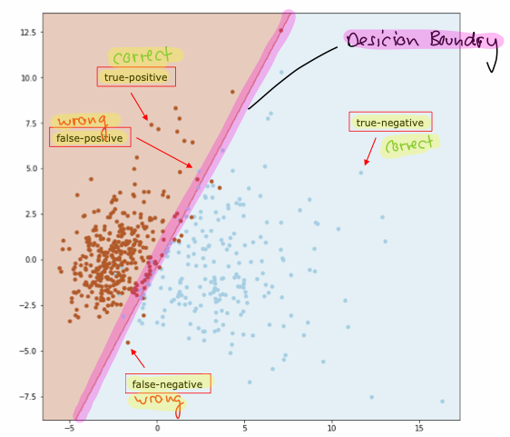
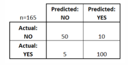

# Supervised Machine Learning

## K-Nearest Neighbors Classification (k-NN)

- k-NN ist der einfachste Machine Learning Algorithmus
- k-NN mit `k = 1` weist nur das Label der nächstgelegenen Traingsprobe zu
- k-NN mit `k > 1` weist das Label zu, welches am meisten in den k nächsten Proben vorhanden ist

``` python
from sklearn.neighbors import KNeighborsClassifier
knn = KNeighborsClassifier(n_neighbors=3) knn.fit(X_train, y_train) y_pred = knn.predict(X_test) acc = accuracy_score(y_test, y_pred)
print("Test Set Accuracy for k=3" + ": {:.2f}".format(acc))
```

- Nachteile
  - sehr langsam, weil die gesamte Berechnung auf die Klassifizierungszeit verschoben wird
- Vorteile
  - gute Wahl für sehr kleine Datasets
  - nicht so datenhungrig wie andere Machine Learning Algorithmen
  - kann auch als Regressionsalgorithmus verwendet werden, indem der Mittelwert aller k-nächsten Nachbarn zugewiesen wird
  - Mehrheitsabstimmung behandelt alle Nachbarn gleich

- Alternativ kann für die Klassifizierung und Regression jedem Nachbarn ein Gewicht geben werden, von 1/d in Abhängigkeit von seinem Abstand d > 0. Dies ist besonders wichtig bei schiefen Daten, da ansonsten die häufigere Klasse die Vorhersage dominiert.
- Die durchschnittliche Entfernung zu den k-nächsten Nachbarn kann auch als lokale
Dichteabschätzung und kann somit als Indikator für die Erkennung von Anomalien dienen.

## Varianten von Machine Learning Models

### Typische Regressions Modelle

- Linear Regression
- Polynomial Regression
- k-Nearest Neighbor Regression
- Support Vector Regression
- Regression Trees
- Neural Networks

### Typische Klassifikations Modelle

- Logistic Regressions
- Naive Bayes
- k-Nearest Neighbors
- Support Vector Machines
- Desicion Trees
- Neural Networks

### Desicion Boundry



### Kernel Trick

- Projeziere die Daten in einer höher-dimensionalen Raum (z.B. aus 2D -> 3D)
- Wird gebraucht wenn die Daten in aktueller Dimension nicht linear separierbar sind
- Kann auch gelöst werden, wenn ein anderes Modell gewählt wird, welches eine nicht lineare Desicion Boundry hat

$$ 2D: x_1, x_2 \rightarrow (x_1 + x_2)^2 \rightarrow 3D: x_1^2, 2x_1x_2, x_2^2 $$

## Einfache ML Qualitätsbewertung

### Einfachster Machine Learning Workflow

- Teile das Dataset in Trainings- und Test-Daten
- Trainiere ein Regressor / Klassifikator auf dem Trainingsset
- Evaluiere die Performance des Modells anhand noch nie gesehenen Daten vom Testset
- funktioniert nur mit viel Daten und fixen Hyperparametern

### Train / Test Split

- Mischen der Daten, ausser wenn man mit Timeseries arbeitet
- Teilen des Sets in Trainings- und Test-Set (empfohlene Teilung 70% / 30%)
- Trainings und Testset müssen disjunkt sein

### Trainieren

- Minimieren der Kostenfunktion auf dem Trainingsset durch Anpassung der Modellparameter

### Testen

- Evaluieren der Performance des Modells anhand noch nie gesehenen Daten vom Testset, mithilfe einer Bewertungsfunktion

## Messung der Qualität der Klassifizierung

### Konfusionsmatrix für binäre Klassifikation

- True-Negative (TN), Klassifikator sagt NEIN und die wahre Antwort ist NEIN
- False-Positive (FP), Klassifikator sagt JA aber die wahre Antwort ist NEIN
- False-Negative (FN), Klassifikator sagt NEIN aber die wahre Antwort ist JA
- True-Positive (TP), Klassifikator sagt JA und die wahre Antwort ist JA



### Genauigkeit (Accuracy) und Fehlerquote (Error Rate)

- Genauigkeit misst wie oft der Klassifikator recht hatte
- Fehlerquote misst wie oft der Klassifikator nicht recht hatte

$$ Accuracy = \frac{TP + TN}{Total} $$
$$ Error Rate = \frac{FP + FN}{Total} = 1 - Accuracy $$

- Genauigkeit nicht für unausgewogene Daten verwenden, sonst hat die Genauigkeit keine Aussagekraft!

### Empfindlichkeit (Sensitivity)

- Wenn der wahre Wert JA ist, wie oft hat das Modell JA vorhergesagt
- Wird auch True-Positive Rate oder Recall genannt

$$ Sensitivity = \frac{TP}{Actual YES} = \frac{TP}{TP + FN} $$

### Spezifität (Specificity)

- Wenn der wahre Wert NEIN ist, wie oft hat das Modell NEIN vorhergesagt

$$ Specificity = \frac{TN}{Actual NO} = \frac{TN}{TN + FP} $$

### Präzision (Precision)

- Ein Problem mit Genauigkeit und Spezifität ist, dass TN nicht immer gezählt werden kann
- Beispiel: TN einer Google-Suchanfrage? 
- Stattdessen Präzision verwenden, wenn das Modell JA voraussagt, wie oft ist es korrekt?

$$ Precision = \frac{TP}{Predicted YES} = \frac{TP}{TP + FP} $$

### F1 Score

- F1 ist das harmonische Mittel zwischen Präzision und Empfindlichkeit
- F1 berücksichtigt keine TN!
- Eigenschaft: F1 ist stark voreingenommen in Richtung der schlechteren Punktzahl
- F1 verwenden, bei einem Klassifizierungsproblem mit schiefen Daten

## Messung der Qualität der Regression

### Wie misst man Regressionsfehler

- Residuum (residuals) sind berechnete Grössen welche den vertikalen Abstand zwischen Beobachtungspunkt und der Regressionsgerade messen

### $R^2$ Coefficient of Determination

$$ R^2 = 1 - \frac{\frac{1}{m} \sum_{i=1}^{m}(y_i - f_i)^2}{\frac{1}{m} \sum_{i=1}^m(y_i - \bar{y})^2} = 1 - \frac{\sum_{i=1}^{m}(y_i - f_i)^2}{\sum_{i=1}^m(y_i - \bar{y})^2} $$

- $R^2$ ist ein statistisches Mass dafür, wie gut die Vorhersagen den realen Datenpunkten entsprechen
- $R^2 = 1$ bedeutet, dass die Vorhersagen perfekt zu den Daten passen
- $R^2 = 0.53$ bedeutet, dass 53% der Varianz in den Daten durch das Modell erklährt werden
- $R^2 < 0$ können auftreten, wenn das Modell zu den Daten schlechter passt als eine horizontale Hyperebene

## ML Qualitätsbewertung in der Praxis

### Hyperparameter

- Sind die manuellen Konfigurationen des Machine Learning Modells
- z.B: k-NN the number of neighors k is a hyperparameter
- Hyperparameteroptimierung nie aufgrund des Testsets wählen!

### Komplexere Auswertungs-Workflows

- Teile die Daten in Trainings-, Validierungs- und Testdaten (empfohlen: 60%/20%/20%)
- Richtige bewertung eines ML Modells
  1. Schleife über alle Hyperparameterkombinationen, welche man ausprobieren möchte
  2. Trainieren des Modells für ausgewählte Hyperparametereinstellung auf dem Trainingsset
  3. Bewerten Sie das Modell anhand des Validierungssets und messen der Leistung
  4. Modell mit der besten Leistung als Kandidat auswählen
  5. Überprüfen des Modells am Testset für die abschliessende Leistungsabschätzung
- Dieser Workflow erfordert eine Vielzahl von Daten

### Cross Validation

- Wenn nicht genügend Daten vorhanden sind um einen Trainings/Validierungs/Test Split zu machen, sollte man eine Cross Validation verwenden
- Teilen der Daten in Trainings- (80%) und Testdaten (20%), die Testdaten werden weggesperrt
- Das Trainingsset wird nun in $k$ verschiedene Blöcke unterteilt, aus denen bei jedem Durchgang einer gewählt wird und als Validierungsset verwendet wird, der Rest wird als Trainingsset verwendet
