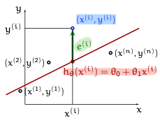
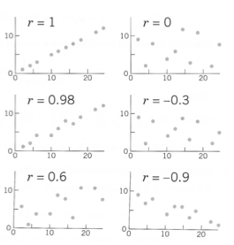
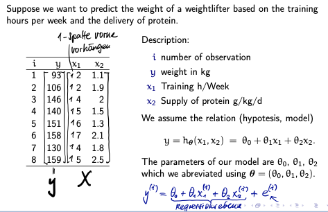
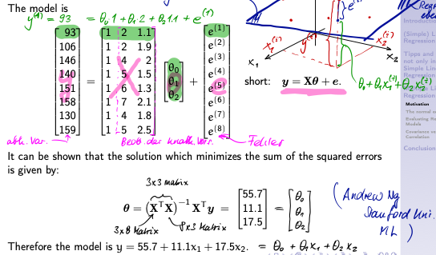

# Linear Regression

- Supervised Machine Learning Algorithmus
- Vorhersage kontinuierlicher Ergebnisse (target values), die auf einer Reihe von Predictor Variablen basieren, wird als **Regressionsanalyse** bezeichnet
- Predictor Variablen sind Variablen, welche gebraucht werden um eine andere Variable vorherzusagen
- Geht davon aus, dass eine lineare Beziehung zwischen Predictor Variablen und Schätzvariablen (estimated variables) besteht
- Einfache Lineare Regressions Modelle haben nur einen Vorhersager (predictor)
- Regression versucht die vertikale Distanz zwischen Datenpunkt und der Modelllinie zu minimieren
- Die vertikale Distanz wird als Residual, Modeling error oder Error beschrieben
- Regressionsanalyse kann auch auf Probleme angewendet werden, bei denen die Bezihung nicht linear ist

## (Simple) Linear Regression

### Die best passende Linie

- Welche Linie passt am besten zu den Stichprobenpunkten?
- Wie wählen wir am besten die parameter $\theta_0$ und $\theta_1$?



### Linie des Modells (Hypothese) oder Regressionslinie

$$ y = h_\theta(x) = \theta_0 + \theta_1 * x $$

### Residual

$$ e^{(i)} = y^{(i)} - (\theta_0 + \theta_1x^{(1)}), i=1, ..., n $$

### Least squares method

- Summe der Quadrate der Fehler minimieren, d.h. die Kostenfunktion minimieren
- $\bar{x}$ und $\bar{y}$ sind die Mittelwerte der x- und y-Werte
- $\theta_1$ ist der Regressions Koeffizient

$$ \bar{x} = \frac{1}{n} \sum_{i=1}^n x^{(i)} $$

$$ \bar{y} = \frac{1}{n} \sum_{i=1}^n y^{(i)} $$

$$
    S_{xy} = \sum_{i=1}^{n}(x^{(i)} - \bar{x})(y^{(i)} - \bar{y}) \\
    S_{xx} = \sum_{i=1}^{n}(x^{(i)} - \bar{x})^2 \\
    S_{yy} = \sum_{i=1}^{n}(y^{(i)} - \bar{y})^2 \\
$$

$$ \theta_1 = \frac{
    \sum_{i=1}^n
    (x^{(i)} - \bar{x})
    (y^{(i)} - \bar{y})}
    {\sum_{i=1}^n
    (x^{(i)} - \bar{x})^2} = \frac{S_{xy}}{S_{xx}} $$

$$ \theta_0 = \bar{y} - \theta_1 \bar{x} $$

#### Beispiel

Die folgenden Zahlenpaare geben den Volumenabfall y (in %) von Leder unter dem Druck x in (MPa) an: **(4, 2.3)**, **(6, 4.1)**, **(8, 5.7)** und **(10, 6.9)**. Berechnen Sie die am besten passende Linie, d.h. die **Regressionslinie**.

1. Berechnen der Mittelwerte $\bar{x}$ und $\bar{y}$

$$ \bar{x} = \frac{1}{4} (4 + 6 + 8 + 10) = 7 $$
$$ \bar{y} = \frac{1}{4} (2.3 + 4.1 + 5.7 + 6.9) = \frac{19}{4} = 4.75 $$

2. Berechnen vom Regressions Koeffizient $\theta_1$

$$ \theta_1 = \frac{(4-7)(2.3-4.75)+(6-7)(4.1-4.75)+(8-7)(5.7-4.75)+(10-7)(6.9-4.75)}
                {(4-7)^2 + (6-7)^2 + (8-7)^2 + (10-7)^2} \\\\
            = \frac{15.4}{20} = 0.77 $$

3. Berechnen von $\theta_0$

$$ \theta_0 = \bar{y} - \theta_1 \bar{x} = 4.75 - 0.77 * 7 = -0.64 $$

4. Berechnen der Regressionslinie $y$

$$ y = \theta_0 + \theta_1 * x = \underline{\underline{-0.64 + 0.77x}} $$

### Coefficient of Determination (R-Squared)

- Die Summe der quadratischen Fehlern ohne Regression, wird als **total sum of squares (SST)** bezeichnet
- **sum of the squared errors (SSE)**
- **sum of squares explained by regression (SSR)**

$$ SSE = \sum_{i=1}^n (y^{(i)} - \hat{y}^{(i)})^2 $$

$$ SSR = \sum_{i=1}^n (\hat{y}^{(i)} - \bar{y})^2 $$

$$ SST =  SSE + SSR $$

- R-Squared sagt etwas über die Genauigkeit der Regression aus, wie gut die Regressionsgerade zu den Datenpunkten passt
- Umso grösser der Wert von $R^2$ ist, umso besser ist die Regression
- $R^2 = 1$, Regression passt perfekt
- $R^2 = 0$, Regression passt gar nicht

$$ R^2 = 1 - \frac{SSE}{SST} $$

#### Beispiel

Die folgenden Zahlenpaare geben den Volumenabfall y (in %) von Leder unter dem Druck x in (MPa) an: **(4, 2.3)**, **(6, 4.1)**, **(8, 5.7)** und **(10, 6.9)**. Berechnen Sie **SSE**, **SST** und $\bold{R^2}$.

1. Berechnen von $SSE$

$$ \text{predicted value of y} = \hat{y} = \theta_0 + \theta_1 * x $$

$$ SSE = (2.3 - 2.44)^2 + (4.1 - 3.98)^2 + (5.7 - 5.52)^2 + (6.9 - 7.06)^2
= \underline{\underline{0.092}} $$

2. Berechnen von $SSR$

$$ SSR = (2.44 - 4.75)^2 + (3.98 - 4.75)^2 + (5.52 - 4.75)^2 + (7.06 - 4.75)^2
= 11.858 $$

3. Berechnen von $SST$

$$ SST = SSE + SSR = 0.092 + 11.858 = \underline{\underline{11.95}} $$

4. Berechnen von $R^2$

$$ R^2 = 1 - \frac{SSE}{SST} = 1 - \frac{0.092}{11.95} = \underline{\underline{0.9923}} $$

### (Pearson) Correlation Coefficient

- Pearson Correlation Coefficient $r$, ist ein Mass für die Korrelation zwischen zwei quantitativen Variablen $X$ und $Y$
- Misst die Stärke der linearen Beziehung zwischen zwei Variablen $x$ und $y$
- Liegt immer zwischen -1 und 1, d.h. $-1 \leq r \leq 1$
- $r = 1$, gerade Linie mit positiver Steigung, linear verwandt, stark korreliert
- $r = 1$, gerade Linie mit negativer Steigung, linear verwandt, start korreliert
- $0 < r \leq 0.5$, schwach korreliert
- $0.5 < r \leq 0.8$, korreliert
- $r = 0$, sind nicht linear verwandt, unkorreliert
- Umso weiter $r$ von 0 entfernt ist, umso stärker ist die lineare Beziehung
- $S_{xy}$ = Summierte Abweichung vom Mittelwert aller Punkte von x und y  
- $s_{xy}$ = Bereich, in dem sich alle Punkte befinden



$$ r = \frac{\sum_{i=1}^n (x^{(i)} - \bar{x}) (y^{(i)} - \bar{y})}
        {\sqrt{\sum_{i=1}^n (x^{(i)} - \bar{x})^2}
        \sqrt{\sum_{i=1}^n (y^{(i)} - \bar{y})^2}}
        = \frac{s_{xy}}{s_x s_y} $$

- Stichprobenabweichung (sample variances)

$$ s_x^2 = \frac{1}{n-1} \sum_{i=1}^n (x^{(i)} - \bar{x})^2 $$
$$ s_y^2 = \frac{1}{n-1} \sum_{i=1}^n (y^{(i)} - \bar{y})^2 $$

- Stichprobenkovarianz (sample covariance)

$$ s_{xy} = \frac{1}{n-1} \sum_{i=1}^n (x^{(i)} - \bar{x})(y^{(i)} - \bar{y}) $$

#### Beispiel

Die folgenden Zahlenpaare geben den Volumenabfall y (in %) von Leder unter dem Druck x in (MPa) an: **(4, 2.3)**, **(6, 4.1)**, **(8, 5.7)** und **(10, 6.9)**. Berechnen Sie den **Pearson Correlation Coefficient**.

1. Berechnen von $r$

$$ r = \frac{(4 - 7)(2.3 - 4.75) + (6 - 7)(4.1 - 4.75) + (8 - 7)(5.7 - 4.75) + (10 - 7)(6.9 - 4.75)}
        {\sqrt{((4 - 7)^2 + (6 - 7)^2 + (8 - 7)^2 + (10 - 7)^2)}*\sqrt{((2.3 - 4.75)^2 + (4.1 - 4.75)^2 + (5.7 - 4.75)^2 + (6.9 - 4.75)^2)}} \\\\
        = \underline{\underline{0.99614}}$$

### Mean Square Error (MSE)

$$ MSE = \frac{SSE}{n-2} = \frac{1}{n-2}\sum_{i=1}^{n}(y_{i}-\hat{y}^{}_{i})^2 $$
$$ \text{Standardabweichung von MSE} = \sqrt{MSE} $$

- Die Regressionskoeffizienten $\theta_0$ und $\theta_1$ sind Schätzungen aus einer einzigen Stichprobe von Grösse n. Die Verwendung einer anderen Probe würde zu unterschiedlichen Regressionskoeffizienten führen.
- Die Standardabweichung der Parameter $\theta_0$ und $\theta_1$ der Probe

$$ 
    s_{\theta_{0}} = \sqrt{MSE} \cdot \sqrt{\frac{1}{n} + \frac{\bar{x}^2}{\sum_{i=1}^{n}{(x^{(i)}-\bar{x})^2}}} \\
    s_{\theta_{1}} = \sqrt{MSE}\cdot \sqrt{\frac{1}{\sum_{i=1}^{n}{(x^{(i)}-\bar{x})^2}}}
$$

- Um das $100 (1 - \alpha)\%$ Confidence Intervall für $\theta_0$ und $\theta_1$ zu berechnen muss man zuerst einen t Test machen, mit $t[1 - \frac{\alpha}{2}; n - 2]$
```python
from scipy.stats import t
t_quant = t.ppf(0.95, n-2)
print("t_quant = ", t_quant)
```
- Um die Confidence Intervalle zu bekommen

$$ 
    \theta_0 \pm t_{quant} * s_{\theta_0} \\
    \theta_1 \pm t_{quant} * s_{\theta_1}
$$

#### Beispiel

Die folgenden Zahlenpaare geben den Volumenabfall y (in %) von Leder unter dem Druck x in (MPa) an: **(4, 2.3)**, **(6, 4.1)**, **(8, 5.7)** und **(10, 6.9)**. Berechnen Sie die Confidence Intervalle für $\theta_0$ und $\theta_1$.

1. Berechne $MSE$

$$ MSE = \frac{SSE}{n - 2} = \frac{0.092}{4 - 2} = 0.046 $$

2. Berechne $s_{\theta_0}$

$$ s_{\theta_0} = \sqrt{0.046} \Bigg [\frac{1}{4} + \frac{7^2}
                                                    {(4^2 - 4*7^2) + (6^2 - 4*7^2) + (8^2 - 4*7^2) + (10^2 - 4*7^2)} \Bigg]^{\frac{1}{2}} $$

...TODO

### Standardisierung oder Neuskalierung von Variablen

- Wenn die unabhängigen Variablen von sehr unterschiedlicher Grösse und Streuung sind, muss man diese standarisieren
- Standardisierte Variable hat einen Mittelwert von 0 und eine Standardabweichung von 1

1. Berechnen des Stichprobenmittelwerts und der Stichprobenabweichung

$$ 
    \hat{\mu_x} = \bar{x} = \frac{1}{n} \sum_{i=1}^n x^{(i)} \\
    \hat{\sigma_x} = s_x = \frac{1}{n - 1} \sum_{i=1}^n (x^{(i)} - \hat{\mu_x})^2
$$

2. Anschliessend die standardisierte (normierte) Variable

$$ \tilde{x}^{(i)} = \frac{1}{s_x} (x^{(i)} - \bar{x}) $$

## Multiple Linear Regression

- Probleme wenn $n$ riesig ist, dann wird es fast unmöglich alle $\theta$ auszurechnen (z.B. bei $10^7$)

### Beispiel



