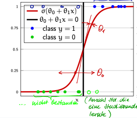

# Logistic Regression

## Wieso Logistic Regression

- Die logistische Regressionsanalyse wird gebraucht um zu überprüfen ob und wie eine abhängige variable $y = {0, 1}$ von einer oder mehreren unabhängigen Variablen $x$ abhängt
- Beispiel abhängige Variablen:
  - Email: Spam ($y = 1$) oder kein Spam ($y = 0$)
  - Person: Krimineller ($y = 1$) oder kein Krimineller ($y = 0$)
  - Student: besteht Prüfung ($y = 1$) oder besteht nicht ($y = 0$)
- unabhängige Variablen sind Metriken oder Encoded Dummy-Variablen im Fall von kategorischen Variablen, zum Beispiel:
  - Email: Vorkommen von Wörtern, Rechtschreibfehler, etc.
  - Person: Aktivitäten, Kollegen, Arbeit, etc.
  - Student: Gelernte Stunden, Partys, genügend Schlaf, etc.
- unabhängige Variablen sollten nicht gross Korreliert sein
- Im Kern der Methode wird die logistische Funktion verwendet, auch Sigmoidfunktion genannt

## Logistische Funktion (Sigmoid)

$$ \sigma(z) = \frac{1}{1 + e^{-z}}, z \in \mathbb{R} $$

$$ \sigma^{\prime}(z) = \sigma(z)(1 - \sigma(z)) $$

$$ \sigma^{\prime\prime}(z) = \sigma(z)(1 - \sigma(z))(1 - 2\sigma(z)) $$

Beispiel einer logistischen regressions Funktion, mit einer input Variable $x$:

$$ y = \sigma(\theta_0 + \theta_1x) = \frac{1}{1 + e^{-(\theta_0 + \theta_1x)}} $$

$$ z = \theta_0 + \theta_1x $$

- blaue Punkte: $y = 1$, Prüfung bestanden
- grüne Punkte: $y = 0$, Prüfung nicht bestanden
- Sigmoid Funktion liefert eine Wahrscheinlichkeit zu welcher Klasse $y = 1$ oder $y = 0$ der Datenpunkt gehört
- Alles mit einer Wahrscheinlichkeit höher als 0.5 gehört zu der Klasse $y = 1$ und alles kleiner als 0.5 gehört zu der Klasse $y = 0$

### Beispiel

Model sagt vorher ob ein Student eine Frau oder ein Mann ist, aufgrund seiner/ihrer Körpergrösse. Gehört die Grösse $h = 155cm$ zu einer weiblichen Studentin oder einem männlichen?

Wir gehen davon aus, dass der Alogithmus $\theta_0 = -100$ und $\theta_1 = 0.6cm^-1$ gelernt. Aufgrund dieser Parameter kann man die Wahrscheinlichkeit $P(male|h = 155cm)$ ausrechnen.

$$ 
    P(male|h = 155cm) = \hat{y} = \frac{1}{1 + exp(-(\theta_0 + \theta_1x))} = \frac{1}{1 + exp(100 - 0.6 * 155)} \\
    = \frac{1}{1 + exp(7)} = 0.9 x 10^{-3}
$$

Die Wahrscheinlichkeit ist fast 0, dass der Student männlich ist.