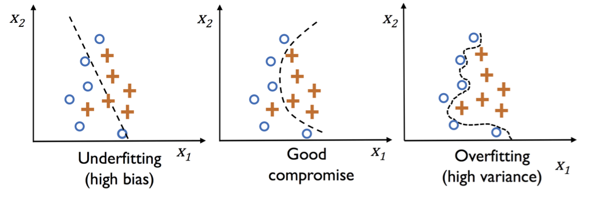
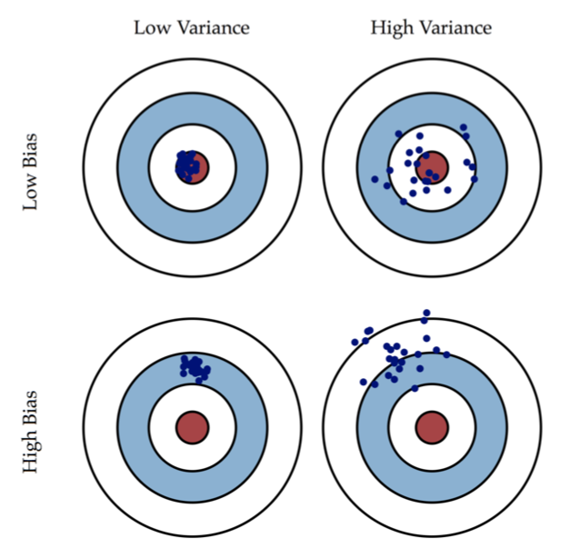

# Regularization

## Under- and Overfitting

- **Underfitting** (high bias) bedeutet, dass das Modell nicht komplex genug ist, um genügend Muster im Trainingsset zu erkennen und zeigt daher schlechte Performanz auf dem Testset, ungesehenen Daten
- **Overfitting** bedeutet, dass das Modell gute Performanz auf den Trainingsdaten hat, aber nicht gute Performanz auf dem Testset, ungesehenen Daten. Es wird auch als **high variance** bezeichnet, was bedeutet, dass eine kleine Änderung in dem Trainingsset den Parameter des Modells drastisch ändert

## High/Low Bias and High/Low Variance

- **Low Bias**: Durchschnittswert ist im Zentrum (korrekt)
- **High Bias**: Durchschnittswert ist weit weg vom Zentrum (nicht korrekt)
- **Low Variance**: Werte sind nicht weit verteilt
- **High Variance**: Werte sind weit verteilt

## Adressing Overfitting

- Mögliche Optionen
  - Reduzieren der Anzahl an Features (Parameter)
    - Manuell selektieren, welche Features behalten werden
    - Model selection algorithm
  - Regularisierung
    - Alle Features behalten, aber die Grösse der Parameter $\theta_i$ verringern
    - Funktioniert gut, wenn es viele Features gibt, und jedes davon nur ein wenig zur Vorhersage von $y$ beiträgt

## Ridge Regularisierung

$$ J(\theta) = \frac{1}{2n} \Bigg[\sum_{i=1}^n (h(\theta, x^{(i)}) - y^{(i)})^2 + \lambda\sum_{j=1}^m \theta_i^2 \Bigg] $$

- Die zweite Summe geht von 1 bis zu der Anzahl an Features $m$ und beinhaltet $\theta_0$ nicht
- Regularisierungsparameter sind $\theta_1, \theta_2, ..., \theta_n$
- Der Regularisierungshyperparameter $\lambda$ kontrolliert die Menge an Regularisierung
  - $\lambda = 0$, keine Regularisierung
  - $\lambda = \infty$, Underfitting, weil nur $\theta_0$ nicht 0 ist
- In der Ridge Regularisierung wählt man $\theta$, so dass man $J(\theta)$ minimiert

