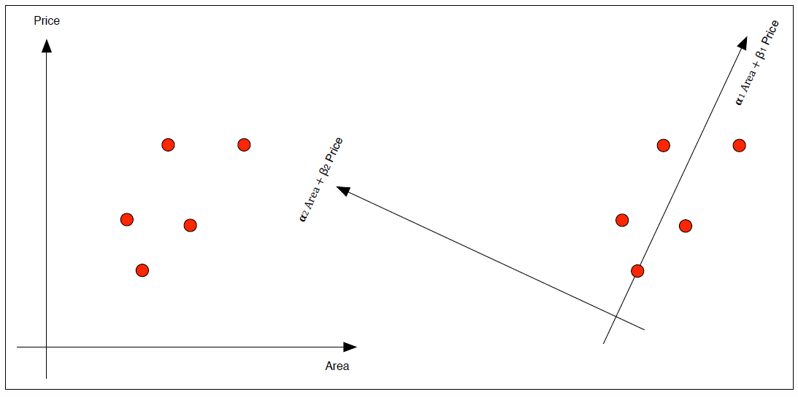

# Dimensionality Reduction

Bei der Dimensionality Reduction geht es darum den Datensatz oder auch deren Features zu verkleinern. So wird die grösse (dimensionalität) des Sets reduziert.

## Data Redundancy

Datenredundanz machen den Datensatz unnötig gross ohne mehr Information zu enthalten. Dabei können teilweise Features entfernt werden, ohne an Informationsgehalt zu verlieren.

- Ein Feature welches immer den selber Wert annimmt, hat Null-Varianz. Somit enthält es keinerlei Information und kann entfernt werden.
- Dabei können auch gleichsagende Features auftauchen (z.B. Fläche in Qudratmeter und Fläche in Qudratcentimeter). Sogenannte Komplett Redundante Features haben eine maximale Kovarianz.
- Falls zwei Features eine Kovarianz über Null besitzen, können sie teilweise redundant sein.
- Idealerweise wird zuerst eine Projektion durchgeführt. Diese kann Kovarianz von Features erhöhen ohne möglicherweise wertvolle Information zu verwerfen.

Dabei können Strategien zur reduktion der Dimensionalität angewandt werden. Zwei behandelte Strategien sind,

- Redundanz eliminieren ohne Informationsverlust
    - Bei komplett Redundanten Features
    - Kombination von Features um die Kovarianz zu verringern/entfernen
- Möglichst wenig Information durch entfernen von Features zerstören
    - Inofrmationsverlust während der Projektion möglichst klein halten. Sprich möglichst kleiner Error oder aber möglichst grosse Varianz der Projektion.

## Projektion zu Basisvektoren und Rotation

Hier wird ein Beispiel für die Projektion eine 2D-Datensatz aufgezeigt. Folgender Datensatz sei in 2D so aufgebaut.

Dieser Datensatz soll jetzt in 1D abgebildet werden und dabei möglichst wenig Informationsgehalt zuverlieren.

#### Einfache Projektion zu einem Basis Vektor

Der Datensatz kann auf die Basis der beiden Achsen projeziert werden. Dies würde einer Verteilung der Datenpunkt aus Sicht von Area/Price entsprechen.

#### Projektion andhand von Transformation

Eine Projektion die den Informationsgehalt weiter konversiert ist die Transformation. Dabei wird ein Punkt des 2D-Plot mit über eine Achse gelegt. Dabei werden die zwei neue Achsen definiert, welche sich über die Winkel der Rotation und den ursprünglichen X/Y-Werten berrechnet wird.

// Formel für x' und y'

Anschliessend kann wieder die Verteilung der Basis Vektoren durchgeführt werden. Diese liegen nun auf der schneideten Achse.

Wenn nun die drei Variationen visualisiert werden. Ergeben sich folgende 1D-Representationen.

Dabei wird ersichtlich die Projektion über die Transformation beinhaltet weiter die Werte beider Dimensionen, Area und Price.

#### Messen von Informationsgehalt

Dabei stellt sich die Frage wie diese drei Projektionen verglichen werden können. Dies geschieht über den Fehler welcher entsteht von der 1D-Projektion zum Wert in 2D. Dabei gilt,

- Umso kleiner der Fehler umso grösser die Varianz. Sprich umsomehr Informationsgehalt liegt in der Projektion.
- Der behalten Gehalt von Informationen zeigt sich über die Varianz der Projektion.
- So ist die beste Projektion, die Projektion welche den Informationsgehalt am wenigsten verringert. Sprich den kleinsten Error oder aber die grösste Varainz aufweist.

## Base Transformation an Daten Matrizen

- $m$ ist die Anzahl Features. $n$ die Anzahl Datensätze.
- $X$ and $Y$ sind $m \times n$ Matritzen.
- $P$ ist eine $m \times m$ Quadratmatrix.

Dabei kann eine Basis Transformation an Matrizen mit folgender Formel durchgeführt werden.

$$ P \times X = Y $$

- Geometrisch gesehen ist $P$ eine Rotation und Verzerrung von $X$ nach $Y$. Auch ausgedrückt als, $P$ führt eine Basis Transformation auf $X$ aus.
- Die Spalten der Matrix $P$ sind die Basis Vektoren von $Y$. Auch genannt `Principal Components`.

## Principal Component Analysis

### Recap Varianz und Kovarianz

Als Recap,

Die Varianz eines einzelnen Feature $X$ mit dem Median Null.

$$ Var(X) = \frac{1}{n-1}\sum_{i=1}^n x_i \cdot x_i $$

Die Covarainz zweier Feature $X$ und $Y$ mit Median Null ergibt sich aus.

$$ Cov(X, Y) = \frac{1}{n-1}\sum_{i=1}^n x_i \cdot y_i $$

Daraus folgt das die Kovarianz-Matrix $\mathbf{S_y}$ einer Matrix $\mathbf{Y}$ sich ergibt aus.

$$ \mathbf{S_y} = \frac{1}{n-1}\mathbf{Y}\mathbf{Y^T} $$

Dabei sind die diagonalen Terme Varianz, und nicht-Diagonale Terme Kovarianz.

### Vorgehen Principal Component Analysis

1. Off-diagonale Terme von $\mathbf{S_y}$ zeigen die Kovarianz. Diese Terme sollten Null-Wert ergeben.
2. Diagonale Terme von $\mathbf{S_y}$ zeigen die Varianz in der eigenen Dimension. Diese Terme können genutzt werden um Features mit geringer Varianz zu ermitteln.

Betrachten wir nocheinmal das Schema der Principal Component Analysis.
Sei $\mathbf{X}$ eine Median-Normalisierte Matritze. Wir suchen für diese eine Matrize $\mathbf{P}$.

$$\mathbf{PX = Y}\qquad \text{und} \qquad \mathbf{S_y} = \frac{1}{n-1}\mathbf{Y}\mathbf{Y^T}$$

So ist $\mathbf{S_y}$ eine Diagonal Matrix. Die Spalten von $\mathbf{P}$ die Principal Components von $\mathbf{X}$.

Die Principal Component Analysis kann so auch ohne $\mathbf{S_y}$ und $\mathbf{Y}$ geschrieben werden. Da $\mathbf{Y} = \mathbf{PX}$.

$$ \mathbf{S_y} = \frac{1}{n-1}\mathbf{YY^T} = \frac{1}{n-1}\mathbf{(PX)}\mathbf{(PX)^T} = \frac{1}{n-1}\mathbf{PXX^TP^T} = \frac{1}{n-1}\mathbf{P(XX^T)P^T}$$

Dabei ist zu beachten das $\mathbf{XX^T}$ symmetrisch ist.

So wird für die Principal Component Analysis nur eine othonormale Matritze $\mathbf{P}$ benötigt, so dass $\mathbf{S_y} = \mathbf{P(XX^T)P^T}$ eine Diagonal Matrix ergibt.

