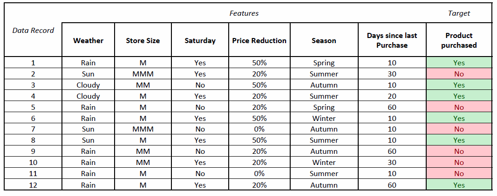
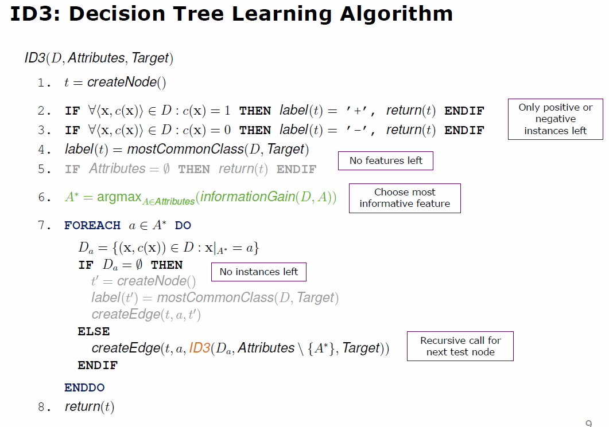
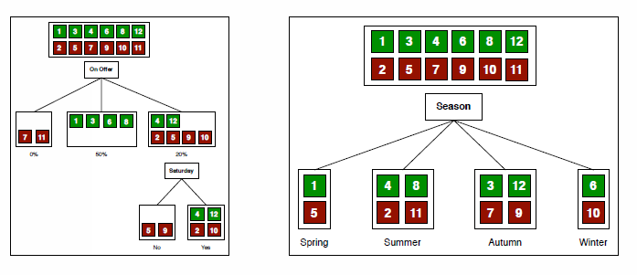
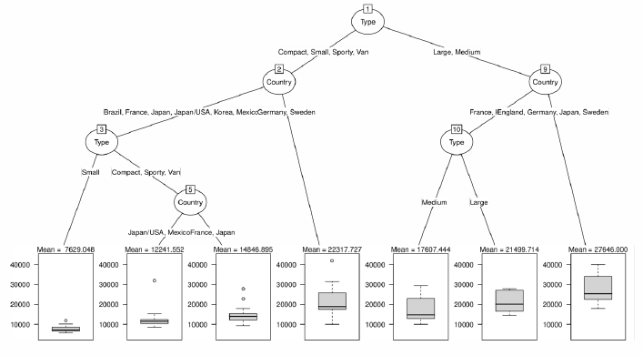

# Supervised Learning: Decision Trees and Random Forests

## Entscheidungsbäume und deren Aufbau

Der Aufbau eines Entscheidungsbaum wird anhand einer Einkauf Predection und Analyse betrieben.

Die folgende Tabelle zeigt ob zum Zeitpunkt eines Einkaufs, welcher über Features definiert wird, Wäschepulver eingekauft wurde.

Der Entscheidungsbaum wird durch filtern von non-informativen features aufgebaut. Es wird dabei versucht nach Features zu unterteilen, bis Knoten nur noch aus einem Label bestehen. Dabei werden folgende Konstruktionsregeln beachtet.

1. Wenn nur noch positive oder negative Datensätze übrig bleiben wird nicht weiter verzweigt. Die entsprechenden Entscheidungswege werden als Blatt-Knoten definiert.
2. Falls positive sowie negative Datensätze übrig bleiben, wird ein neues Feature gewählt um den Baum mit diesem zu erweitern.
3. Falls ein Knoten leer bleibt, wird zum Eltern-Knoten zurück gewechselt und eine anderes Feature gewählt.
4. Falls weiter gemischte Knoten bestehen aber keine weiteren Features vorhanden sind, sind die Trainingsdaten nicht-determistisch, kontradiktionär, besitzen Rauschen oder haben versteckte Features. In diesem Fall wird sich für das im Knoten häufigsten befindliche Label entschieden.

## ID3: Decision Tree Learning Algorithmus

## Geschichte von Entscheidungsbaum Algorithmen

- ID3 (Iterative Dichotomiser 3) von J.R. Quinlan in 1986
    - Benützt Information Gain für die Feature Selektion
- C4.5 erweiterte Version des ID3, ebenfalls durch J.R. Quinlan
    - Nutzt ebenfalls Information Gain für Feature Selektion
    - Nummerische Features werden mit integriert
    - Bessers tree pruning
    - Features besitzen Kosten
- CART (Classification and Regression Trees) ähnlich zu C4.5
    - Kann für Klassifikation sowie Regression verwendet werden
    - Nutzt bei der Klassifizierung den Gini index für die Feature Selektion
    - Nutzt bei der Regression Varianz Reduktion (mean squared error)  für die Feature Selektion
    - Konstruiert für jeden möglichen Split einen Binären-Baum
    - das scikit-learn Modul nutzt eine optimierte Version des CART Algorithmus

## Splitting Criterion

Das Slitting Criterion beschreibt die Grundlage auf welchem Feature gesplittet werden soll. Ein Splitting wird aufgrund des Informationsgehalt eines Features durchgeführt.

Im gezeigten Bild ist ein Splitting nachdem Feature "On Offer" informativer als das Feature "Season".

Um den Informationsgehalt messen zu können gibt es zwei Varianten. Einerseits `Information grain` und den `Gini index`.

## Gini index

Die Frequenz der Daten als Wahrscheindlichkeit für das Auftreten interpretiert. Mithilfe der `Gini Impurity` wird gemessen, wie oft ein zufällig Ausgesuchtes Element aus dem Set falsch gelabelt wird, falls es zufällig zur Verteilung der Labels gelablet worden wäre. Was der Frequenz des Feature zum Label entspricht.

Die Gini Impurity liefert dabe ein nicht-negatives Resultat. Falls ein Feature den gesamten Node für eine Kategorie aufteilt, ist die Gini Impurity gleich Null. Daher wird beim Gini Index das Feature mit dem tiefsten Gini Impurity Wert (Informationsgehalt) gewählt.

//  Formel gini berechnung

## Regression Trees in CART

Ein Regressions Baum mithilfe von CART, predicted den Durchschnitt aller Instanze iner Kategorie in einem Blatt Knoten. Werde dabei gleich aufgebaut wie ein Klassifikations Baum, mit jedoch unterschiedlichen Splitting Kriterien. Beim Splitting Cirterion bei Regressions Bäumen wird versucht die Varianz von Werten im gleichen Subset zu minimieren.

## Vor- und Nachteile von Decision Trees

### Vorteile

- Entscheidungsbäume sind einfach zu verstehen und interpretieren
    -   Dient dem Menschen. Vertraut eher Ansätzen die er versteht.
- Entscheidungsbäume können nummerische sowie kategorische Probleme lösen
    -   Egal ob Features oder Labels
- Entscheidungsbäume brauchen kaum Data Preperation
- Entscheidungsbäume haben auch bei grossen Datensets eine akzeptable Performanz

### Nachteile

- Entscheidungsbäume sind meistens Ungenauer als andere Ansätze
- Meistens werden zu komplexe Bäume, welche nicht genug genralisieren aufgebaut
    - Pruning ist sehr zentral beim trainieren eines Entscheidungsbaum
- Kleine Änderungen im Datenset können zu grossen Änderungen im Entscheidungsbaum führen.
    - Sehr sensitiv auf Data quality

### Zwei Probleme mit Entscheidungsbäumen

- Tiefe Entscheidungsbäume tendieren zum aufzeigen von irregulären Mustern. Tritt dies auf spricht man von Overfitting.
- Entscheidungsbäume sind sehr sensitiv auf die Trainingsdaten

Diesem Problem wird mit Random Forests abhilfe geschaffen.

## Random Forests

Ein Random Forest ist eine einfache Kollektion von Entscheidungsbäume. Dabei sind die Bäume auf dem gleichen Trainingsdaten aufgebaut. Jedoch wird dafür,

- Random Sampling und Replacement
- Random attribute selection

genutzt um die Bäume unterschiedlich zu gestalten. Für die Prediction wird ein Resultat aller Bäume angefordert. Anschliessend wird über ein Voting Verfahren ein Resultat ausgewählt.

### Trainingsphase

- Wähle ein zufälliges Unterset $D^*$ aus dem Trainingsset $D$
- Wähle ein zufälliges Unterset $A^*$ aus den Attributen $A$
- Trainiere einen Entscheidungsbaum aus $A^*$ und $D^*$
- Wiederhole dies bis die Anzahl an gewünschten Entscheidungsbäumen erreicht ist

### Decision Phase

- Erstelle eine Prediction aus jedem Eintscheidungsbaum im Random Forest
- Kombiniere die Resultate und finde eine Entscheidung mit Voting oder Average Verfahren.

## Association Rules vs. Decision Trees

- Das suchen nach Association Rules geht in die Kategorie des Unsupervised Learning. Das erstellen von Decision Trees gehört zum Supervised Learning
- Association Rules verbinden nur die Informationen einer Transaktion (z.B. was würde zusammen gekauft). Decision Trees ziehen auch andere Informationen bei (z.B. Wochentag, Season, Store Location).
- Beide Techniken können genutzt werden um personalsierte sowie unpersonalisierte Probleme genutzt werden (z.B. Porfiling eines Individuum oder eine Zielgruppe aller Kunden)

